<section id="themes">
	<h2>Themes</h2>
		<p>
			Set your presentation theme: <br>
			<!-- Hacks to swap themes after the page has loaded. Not flexible and only intended for the reveal.js demo deck. -->
			<a href="#" onclick="document.getElementById('theme').setAttribute('href','css/theme/black.css'); return false;">Black (default)</a> -
			<a href="#" onclick="document.getElementById('theme').setAttribute('href','css/theme/white.css'); return false;">White</a> -
			<a href="#" onclick="document.getElementById('theme').setAttribute('href','css/theme/league.css'); return false;">League</a> -
			<a href="#" onclick="document.getElementById('theme').setAttribute('href','css/theme/sky.css'); return false;">Sky</a> -
			<a href="#" onclick="document.getElementById('theme').setAttribute('href','css/theme/beige.css'); return false;">Beige</a> -
			<a href="#" onclick="document.getElementById('theme').setAttribute('href','css/theme/simple.css'); return false;">Simple</a> <br>
			<a href="#" onclick="document.getElementById('theme').setAttribute('href','css/theme/serif.css'); return false;">Serif</a> -
			<a href="#" onclick="document.getElementById('theme').setAttribute('href','css/theme/night.css'); return false;">Night</a> -
			<a href="#" onclick="document.getElementById('theme').setAttribute('href','css/theme/moon.css'); return false;">Moon</a> -
			<a href="#" onclick="document.getElementById('theme').setAttribute('href','css/theme/solarized.css'); return false;">Solarized</a>
		</p>
</section>

H:

# Proscene3 Design

Jean Pierre Charalambos & Sebastian Chaparro

National University of Colombia

H:

# Outline

 1. Goal
 2. Design
 3. Demo
 4. Future work

H:

## Goal

> Provide interactivity to _application objects_ from any _gesture input source_

in the simplest possible way:
<!-- .element: class="fragment" data-fragment-index="1"-->

<li class="fragment"> api simplicity
<li class="fragment"> api flexibility
<li class="fragment"> customizability

N:

... which may be evaluated by:
* (API simplicity), that relates the set of instructions needed to accomplish a standard task
over a given domain -> 'the less instructions the simple the API is'
* (API flexibility), that relates as to whether or not an advanced task can be accomplished by the
framework and if so, how.
* (Customizability), which relates software maintenance
and extensibility, such as when adding new hardware and/or
a new application user-defined actions

V:

## Goal: Interactivity

Universal interaction tasks:

 1. Viewpoint manipulation <!-- .element: class="fragment" data-fragment-index="1"-->
 2. Picking & Manipulation <!-- .element: class="fragment" data-fragment-index="2"-->
 3. Application Control <!-- .element: class="fragment" data-fragment-index="3"-->

"A Survey of Interaction Techniques for Interactive 3D Environments", Jankowski et al., 2013 - STAR.
<!-- .element: class="fragment" data-fragment-index="4"-->

N:

To cope with the so called three universal interaction tasks for Interactive Environments, which are:

1. Viewpoint manipulation in 3D as well as in 2D
2. Object selection & Interaction
3. Implementation of 'post-WIMP ((W)indows (I)cons (M)enus & (P)ointer) _interaction metaphors_

Jankowski relatively recent survey provides a good starting point

V:

## Goal: Interactivity
### Viewpoint manipulation: 3rd person

<video controls data-autoplay loop src="vid/flock.ogv"></video>

N:

This video shows a 3rd person camera control follow-up of the 'Boids' original famous 2D experiment [Craig Reynolds, 1986]. The example is included in the std distro

V:

## Goal: Interactivity
### Viewpoint manipulation: HID's

<video controls data-autoplay loop src="vid/kinect.mp4"></video>

N:

This video displays part of a recent usability comparative study using non-std interaction techniques. Developed as M. Sc. thesis

V:

## Goal: Interactivity
### Picking & Manipulation -> select & interaction

<video controls data-autoplay loop src="vid/cut.mp4"></video>

N:

This video shows an excerpt of an audio reactive multitouch tabletop screen app, developed in collaboration with ['the creators'](https://vimeo.com/25224777) Information Visualisation studio, University of Sydney

V:

## Goal: Interactivity
### Application Control -> 'post-'WIMP interaction metaphors

<video controls data-autoplay loop src="vid/app_ctrl.ogv"></video>

N:

This video shows how the 3D shapes can easily be controled and manipulated with the 2D ones. The example is included in the std distro

V:

## Goal

It is also about:

<li class="fragment"> Creating academic materials
<li class="fragment"> Appropriation through collaboration

N:

* Creating academic materials comprising software + documentation (API-docs + html5 e-book, tutorials & wikis)
* Open-sourcing the materials to encourage hacking them

H:

## Design
### _Onion_ architecture

<figure>
    
    <figcaption>Packages</figcaption>
</figure>

N:

We employ an 'onion architecture' which controls coupling: all code can depend on core layers (but no the other way around). Those layers are implemented as *git subtrees*

H:

## Bias

<figure>
    
    <figcaption>Packages</figcaption>
</figure>

V:

## Bias: Package

> (B)ogus (I)nput (A)ction (S)elector

N:

Action = user-defined callback routine

V:

## Bias: goal

<figure>
    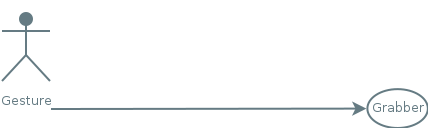
    <figcaption>Communication channel</figcaption>
</figure>

N:

Open up a communication channel between user gestures and grabber objects

V:

## Bias: User gestures

<figure>
    
    <figcaption>Input sources</figcaption>
</figure>

N:

Such as ... (B)rain (C)omputer (I)nterface or any (H)uman (Interface) (D)evice

V:

## Bias: Grabbers

<figure>
    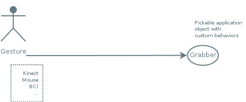
    <figcaption>Pickable </figcaption>
</figure>

N:

Grabbers are user-space objects possibly having a visual representation

V:

## BIAS: Grabbers

```java
public interface Grabber {
	boolean checkIfGrabsInput(BogusEvent event);
	void performInteraction(BogusEvent event);
}
```

N:

Grabbers have a very simple specification:
1. Defines the rules to set the application object as an input grabber
2. Defines how the application object should behave

V:

## Bias: BogusEvents

<figure>
    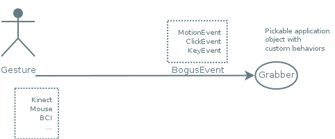
    <figcaption>Input sources</figcaption>
</figure>

N:

Input sources are represented by so called bogus events. An event is bogus in that it is a high-level (soft) event which should be reduced from a low-level event

Lets see some bogus events features...

V:

## BIAS: BogusEvents
### Shortcuts

> A gesture identifier

N:

Example:
* the mouse button + modifier mask when a dragging gesture is taking place

V:

## BIAS: BogusEvent
### MultiTempi

<li class="fragment"> ```fired()```: event instantiation
<li class="fragment"> ```flushed()```: event termination
<li class="fragment"> ```!fired() && !flushed()```: event execution (default state)

N:

Example:
* ```fired()``` -> mouse pressed
* ```flushed()``` -> mouse released
* ```!fired() && !flushed()``` -> mouse dragged

V:

## BIAS: BogusEvent
### Types

_BogusEvent_ instances are of the following types:

 * KeyboardEvent
 <!-- .element: class="fragment" data-fragment-index="1"-->
 * ClickEvent
 <!-- .element: class="fragment" data-fragment-index="2"-->
 * MotionEvent
 <!-- .element: class="fragment" data-fragment-index="3"-->
   * DOF1Event
   * DOF2Event
   * DOF3Event
   * DOF6Event
   
N:

* ... defining a single key stroke; or, a combo key stroke: single key stroke + modifier key
* ... defining a "tap" event
* ... defining the app kinematics & which are characterized by DOFs

V:

## Bias: Agent
### BogusEvent reduction object

<figure>
    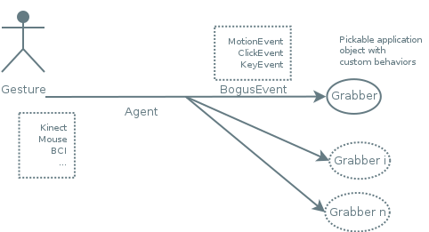
    <figcaption>Collect and reduce input into a _BogusEvent_</figcaption>
</figure>

N:

An agent is a BogusEvent reduction object. Its goal is to collect and reduce input into a _BogusEvent_

V:

## Bias: Agent

<figure>
    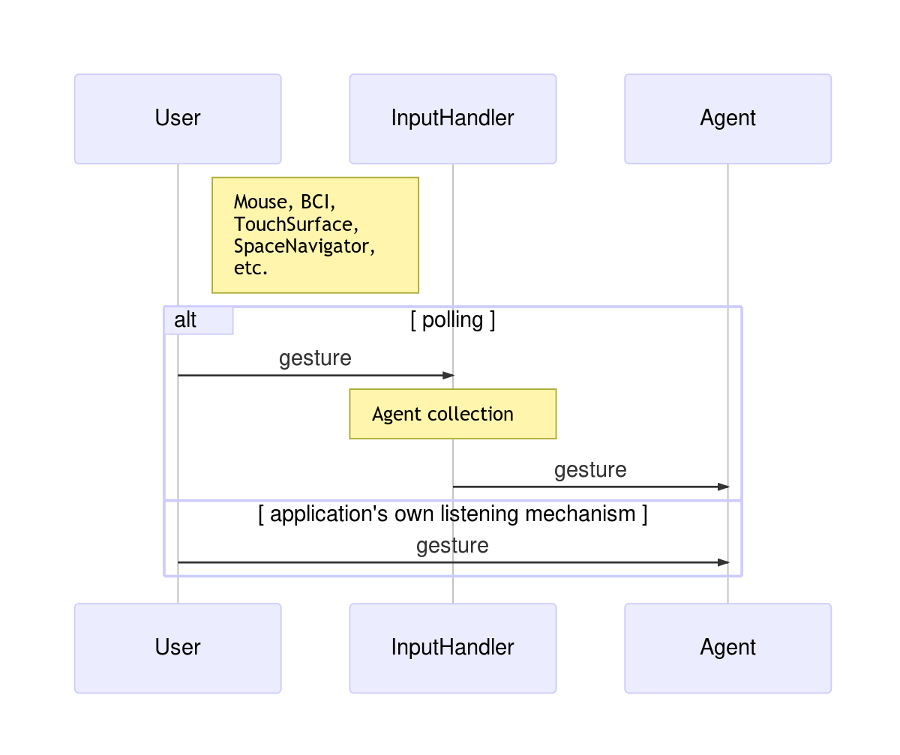
    <figcaption>Listening mechanisms</figcaption>
</figure>

N:

Agents provide 2 listening mechanisms:
1. Polling, which is done throught the InputHandler (high-level package handler)
2. Using the application's own listening mechanism

V:

## Bias: Agent
### Message types sent to grabbers

| Agent                         | Grabber                    |
|-------------------------------|----------------------------|
| ```updateTrackedGrabber()```  | ```checkIfGrabsInput()```  |
| ```handle()```                | ```performInteraction()``` |

N:

* The *uTG* _agent_ call is related to the *cIGI* _grabber_ call
* The *h* _agent_ call is related to the *pI* _grabber_ call

lets see how

V:

## Bias: Agent

<figure>
    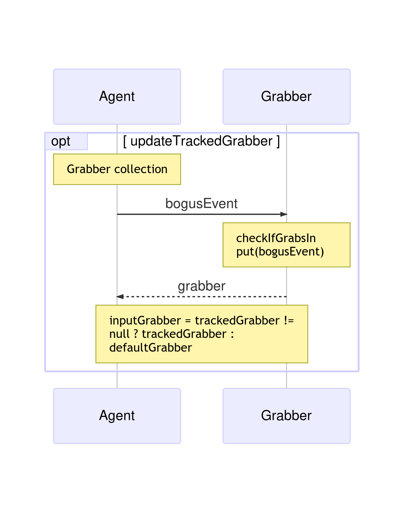
    <figcaption>updateTrackedGrabber()</figcaption>
</figure>

N:

In the *uTG* case the
1. Agent queries each object in the *grabbers* collection to check if the *cIGI* condition is met
2. The first object meeting it will be set as application the inputGrabber() and returned

V:

## Bias: Agent

<figure>
    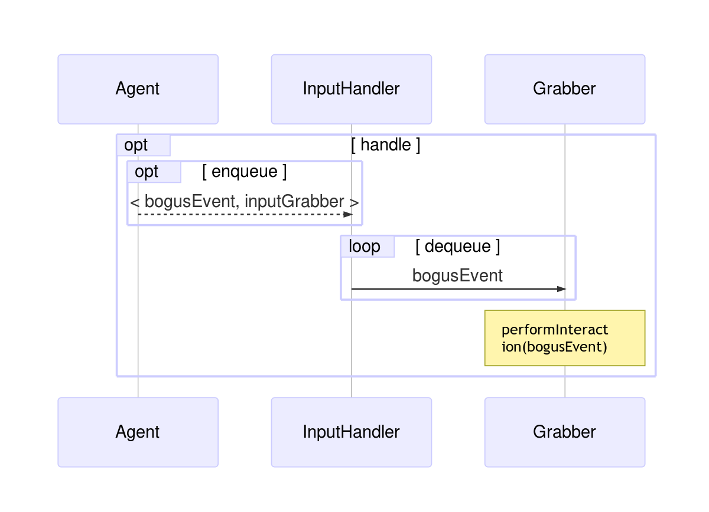
    <figcaption>handle()</figcaption>
</figure>

N:

In the *h* case the
1. The agent enqueues an ```EventGrabberTuple()``` on the
InputHandler ```eventTupleQueue()```.
2. At the end of main event loop the *pI*
method is then called on the ```inputGrabber()```

V:

## BIAS: Grabber Profile

A [functional programming](https://en.wikipedia.org/wiki/Functional_programming) extension which parses the event in
```grabber.performInteraction(BogusEvent event)```
to define _Shortcut_ to _Action_ bindings

```java
@Override
public void performInteraction(BogusEvent event) {
    profile.handle(event);
}
```
<!-- .element: class="fragment" data-fragment-index="1"-->

N:

1. ... to set it up just override
the _grabber_ ```performInteraction``` method like this:

V:

## BIAS
### Grabbers: Profile

Profiles allow the following high-level simple dialect:

```java
grabber.setMotionBinding(LEFT, "callback_method");
```
<!-- .element: class="fragment" data-fragment-index="1"-->

```java
grabber.setKeyBinding('x', "callback_method");
```
<!-- .element: class="fragment" data-fragment-index="2"-->

```java
grabber.setKeyBinding(SHIFT, 'y', "callback_method");
```
<!-- .element: class="fragment" data-fragment-index="3"-->

```java
grabber.setClickBinding(RIGHT, '2', "callback_method");
```
<!-- .element: class="fragment" data-fragment-index="4"-->

V:

## BIAS: Conclusions

<li class="fragment"> Target audience: Gesture parsing programmers
<li class="fragment"> Lightweight Java-based implementation + Single-threaded + No-dependencies
<li class="fragment"> Multi-language support
<li class="fragment"> A wide scope of interactive applications
<li class="fragment"> Software maintenance and extensibility

N:

* ... machine learning developers
* ... can easily be plugged into any third-party visual computing application
* ... java + android + js (but also 3rd party python and ruby ports are known to as)
* ... ranging simple to very complex setups, even allowing concurrency of input events on application objects
* ... such as when adding new hardware and/or user-defined actions

H:

## Dandelion

<figure>
    
    <figcaption>Packages</figcaption>
</figure>

V:

## Dandelion: Goal

> Interactivity to *frames* (coordinate systems)

V:

## Dandelion
### Packages

<li class="fragment"> *dandelion.geom*
<li class="fragment"> *dandelion.constraint*
<li class="fragment"> *dandelion.core* 

N:

* ... _Vec_, _Quat_, _Mat_ and _Frame_ (_Quat_ + _Vec_)
* ... Apply constraints to _Frames_ to limit their motion
* ... detailed shortly

V:

## Dandelion
### Frame: Hierarchy

```sh
 world
  ^
  |\
  | \  
  f1 eye
  ^   ^
  |\   \
  | \   \
  f2 f3  f5
  ^
  |
  |
  f4
```

```java
  frame.setReferenceFrame(parent);
```

N:

The collection of ```frames()``` forms a scene-graph of transformations
which only requires that each frame keeps a reference to its parent

V:

## Dandelion
### GenericFrame

> A Grabber Frame

Features:

<li class="fragment"> Generic
<li class="fragment"> Scene-graph foundation
<li class="fragment"> Third-person camera

N:

A Grabber Frame: a frame that implements the _Grabber_ interface -> Frames that are pickable and interactive

* A _gF_ is *generic* in that it can belong either to an object or to the Eye
* _gFs_ are organized in a tree-like structure allowing top/down traversals of the hierarchy
* A _gF_ can be followed by another _gF_

V:

## Dandelion
### KeyFrameInterpolator

[Catmull Rom splines](https://en.wikipedia.org/wiki/Cubic_Hermite_spline#Catmull.E2.80.93Rom_spline) key frames

<video controls data-autoplay loop src="vid/just_cause.mp4"></video>
<!-- .element: class="fragment" data-fragment-index="1"-->

N:

Point cloud visualization of 11' player impact events in the videogame, Just Cause 2. Developed in collaboration with [Square Enix](https://www.youtube.com/watch?v=hEoxaGkNcrg&feature=player_embedded#at=19)

V:

## Dandelion
### Eye

A 2D (Window) & 3D (Camera), featuring:

<li class="fragment"> Useful positioning tools
<li class="fragment"> Simple bounding area/volume view
<li class="fragment"> Back-face & view frustum culling
<li class="fragment"> Stereo capabilities

N:

* ... which eases its placement
* ... which is defined by a bounding ball, while targetting the [z-Buffer precision](https://www.opengl.org/wiki/Depth_Buffer_Precision)
* ... supporting advanced interactive apps
* ... just in time for the _android cardboard_

V:

## Dandelion
### AbstractScene: high-level scene-graph API

High-level scene handler which manages:

<li class="fragment"> Visual hints
<li class="fragment"> Traversal algorithm: ```for (GenericFrame frame : leadingFrames()) visitFrame(frame)```
<li class="fragment"> Frame-hierarchy
<li class="fragment"> BIAS agents

V:

## Dandelion: Conclusions

<li class="fragment"> Target audience: scenegraph programmers
<li class="fragment"> Multi-language
<li class="fragment"> Those of BIAS

N:

* ... programmers which want to build upon a (simple and coherent) scenegraph foundation
* ... java + android + js (but also 3rd party python and ruby ports are known to as)
* ... e.g., it can easily be plugged into any third-party visual computing application

H:

## Proscene3

<figure>
    
    <figcaption>Packages</figcaption>
</figure>

V:

## Proscene3

> Bridge between Dandelion and [Processing3](http://processing.org)

N:

... providing seamless thorough integration between the two, while taking full advantage of Processing main features such as its concise API and advanced-rendering capabilities

V:

## Proscene3
### InteractiveFrame

* _InteractiveFrame_ -> _GenericFrame_ [PShape](https://processing.org/reference/PShape.html) wrapper implementing ```checkIfGrabsInput(event)``` using a [picking buffer](http://content.gpwiki.org/index.php/OpenGL_Selection_Using_Unique_Color_IDs)
<figure>
    
    <figcaption>Picking buffer</figcaption>
</figure>

V:

## Proscene3
### Scene: high-level scene-graph API

<li class="fragment"> Default rendering of shapes not already present in the Processing API
<li class="fragment"> Traversal algorithm: ```scene.drawFrames()```
<li class="fragment"> InterativeFrames can be projected onto an arbritary number of (off-screen) graphics buffer

N:

* ... such hollow cylinder or cone
* ... achieved with one simple line of code
* ... e.g., minimaps

V:

## Proscene3
### Envisaged interactive scenarios: Appearance

```java
  public void setup() {
    frame = new InteractiveFrame(scene, createShape(SPHERE, 40));
  }
```

N:

This simple code creates a pickable fully interactive sphere

V:

## Proscene3
### Envisaged interactive scenarios: Custom Appearance

```java
  public void setup() {
    frame = new InteractiveFrame(scene, this, "boxDrawing");
  }
  
  public void boxDrawing(PGraphics pg) {
    pg.box(30);
  }
```

N:

Fully interactive _arbitrary_ graphics procedures, like the one in this code, require no inheritance

V:

## Proscene3
### Envisaged interactive scenarios: Actions

```java
  public void setup() {
    frame.setMotionBinding(LEFT, "translate");
  }
```

N:

Binding a _default_ motion action (```translate```) is as simple as this code

V:

## Proscene3
### Envisaged interactive scenarios: Custom Actions

```java
  public void setup() {
    frame.setMotionBinding(this, LEFT, "boxCustomMotion");
  }
  
  public void boxCustomMotion(InteractiveFrame frame, MotionEvent event) {
    frame.screenRotate(event);
  }
```

N:

Binding a _custom_ motion action (```translate```), like this code, require no inheritance

V:

## Proscene3
### Envisaged interactive scenarios: MultiTouch Agent
#### Demo

<video controls data-autoplay loop src="vid/android.mp4"></video>

N:

Currently being part of M. Sc. by Victor Forero
* Gestures recognization is key
* (Event though it already works) Future work includes using machine learning techniques to improve it
* Support up till DOF6 actions

V:

## Proscene3: Conclusions

<li class="fragment"> Target audience: that of [Processing](https://processing.org/)
<li class="fragment"> Multi-language
<li class="fragment"> Those of Dandelion & BIAS

N:

* ... i.e., visual artists & designers and hobbyists where simplicity is _key_
* ... java + android + js (but also 3rd party python and ruby ports are known to as)
* ... but already pluged in into Processing

H:

## Demo
### Interactive Tools and Applications

<li class="fragment"> Deformation of 2D images and 3D meshes
<li class="fragment"> Forward Kinematics Hierarchical Model
<li class="fragment"> Inverse Kinematics
<li class="fragment"> Artificial Life Aquarium

V:

## Demo: Deformation 2d & 3D
<figure>
    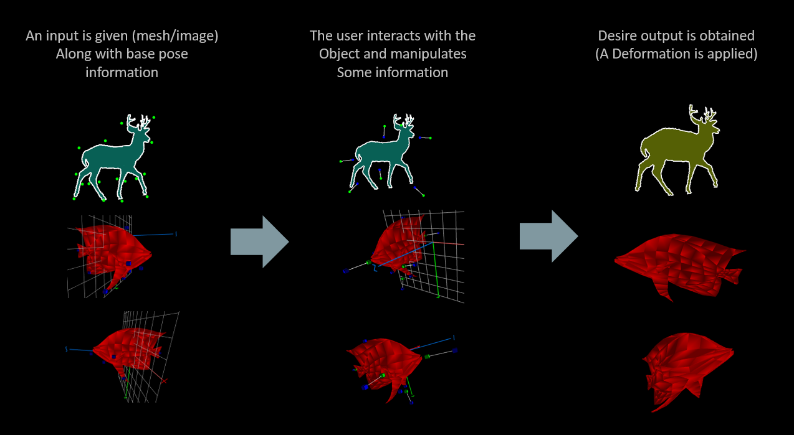
    <figcaption>Flow</figcaption>
</figure>

V:

## Demo: Deformation 2d & 3D
### Interactive Tools
<li class="fragment"> There are required  tools with which the user could interact that allows to relate some action with a specific region of the image/mesh input (BIAS).
<li class="fragment"> We extend the class interactive Frame (Dandelion) to associate to them information about the image/mesh.

V:

## Demo: Deformation 2d & 3D

<figure>
    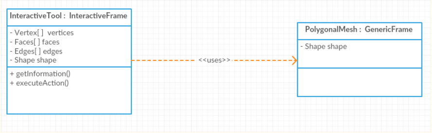
    <figcaption>Interactive Tool</figcaption>
</figure>

V:

## Demo: Deformation 2d & 3D

<figure>
    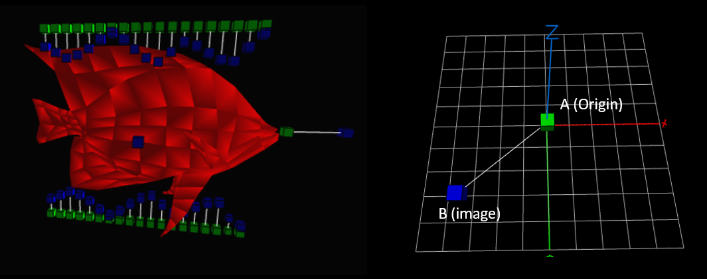
    <figcaption>Control Points</figcaption>
</figure>

A transformation (B) is related to a given point (A)

V:

## Demo: Deformation 2d & 3D

<figure>
    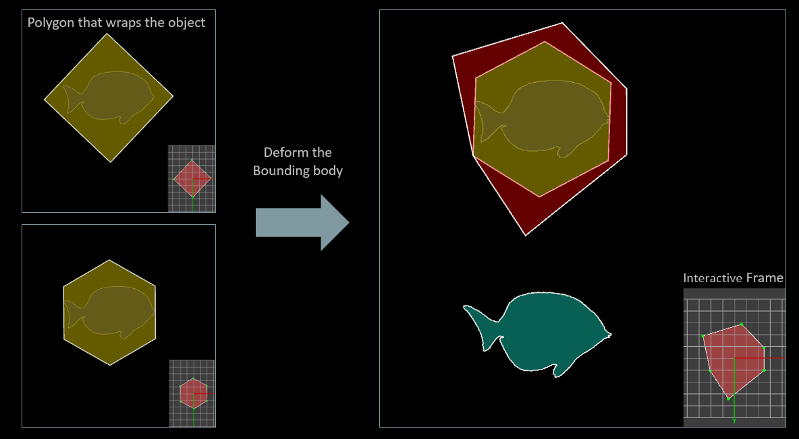
    <figcaption>Bounding Body</figcaption>
</figure>

A deformation performed to a regular polygon is applied to the input object

V:
## Demo: Deformation 2d & 3D
[2D](https://github.com/sechaparroc/Deformation) and [3D](https://github.com/sechaparroc/Deformation3D) Deformation

<video controls data-autoplay loop src="vid/deformation.mp4"></video>

V:
## Demo: Deformation 2d & 3D
### Related Papers

<li class="fragment"> Schaefer S, McPhaill T, Warren J. [Image Deformation Using Moving Least Squares](http://faculty.cs.tamu.edu/schaefer/research/mls.pdf)
<li class="fragment"> Sorkine O, Cohen D, Lipman Y, Alexa M, Rossl C, Seidel H. [Laplacian Surface Editing](http://www.cs.berkeley.edu/~jrs/meshpapers/SCOLARS.pdf).

V:

## Demo: Forward Kinematics 

<figure>
    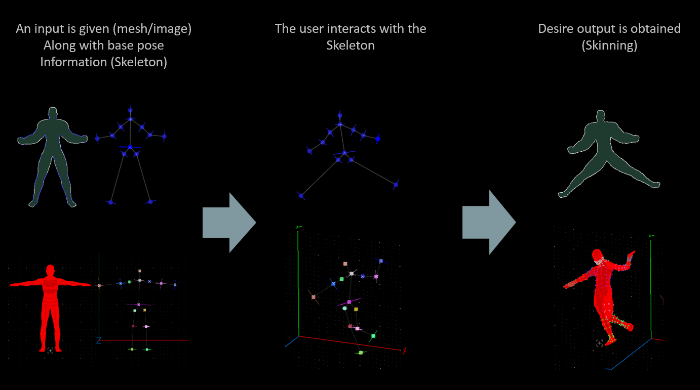
    <figcaption>Flow</figcaption>
</figure>

V:

## Demo: Forward Kinematics 

<figure>
    
    <figcaption>Interactive Tool</figcaption>
</figure>

V:

## Demo: Forward Kinematics 
<figure>
    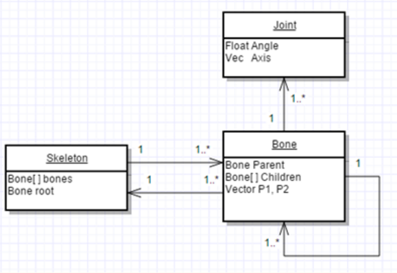
    <figcaption>Hierarchical Kinematic Model</figcaption>
</figure>

V:

## Demo: Forward Kinematics 

<figure>
    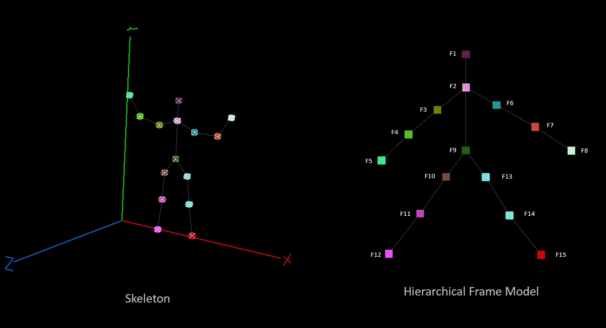
</figure>

Is a typical model used in Kinematics. A Bone is related to a Joint that provides DOF 3. (local coordinates and hierarchy) 

V:
## Demo: Forward Kinematics 
Hierarchical Kinematic Model [2D](https://github.com/sechaparroc/Kinematics-Laplacian) and [3D](https://github.com/sechaparroc/Kinematics-Laplacian-3D).
<video controls data-autoplay loop src="vid/kinematics.mp4"></video>

V:
## Demo: Forward Kinematics 
### Related Papers
<li class="fragment"> Buss S. [Introduction to Inverse Kinematics](http://www.math.ucsd.edu/~sbuss/ResearchWeb/ikmethods/iksurvey.pdf)
<li class="fragment"> Sorkine O, Cohen D, Lipman Y, Alexa M, Rossl C, Seidel H. [Laplacian Surface Editing](http://www.cs.berkeley.edu/~jrs/meshpapers/SCOLARS.pdf)
<li class="fragment"> University Of California, Computer Animation Course. [Skinning](http://graphics.ucsd.edu/courses/cse169_w05/3-Skin.htm)


V:

## Demo: Inverse Kinematics 
<figure>
    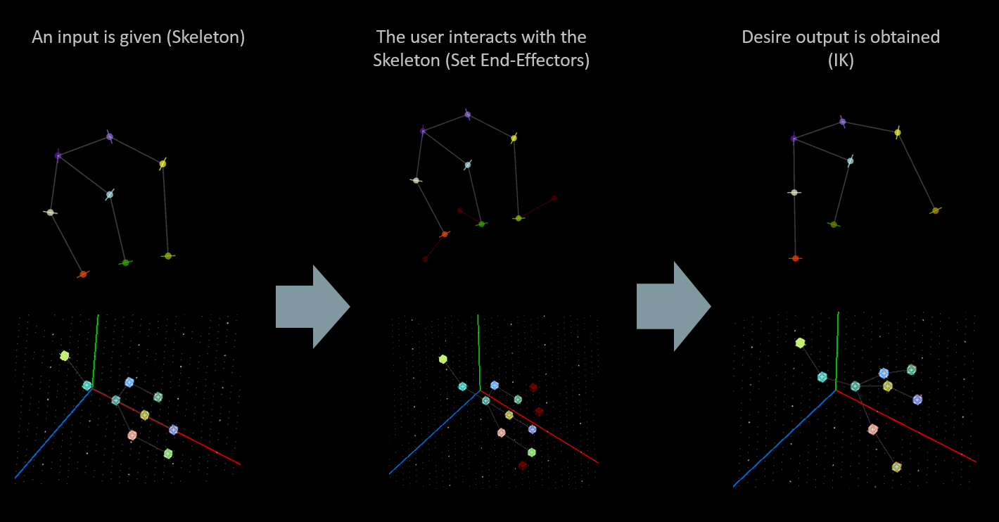
    <figcaption>Flow</figcaption>
</figure>

V:

## Demo: Inverse Kinematics 

<figure>
    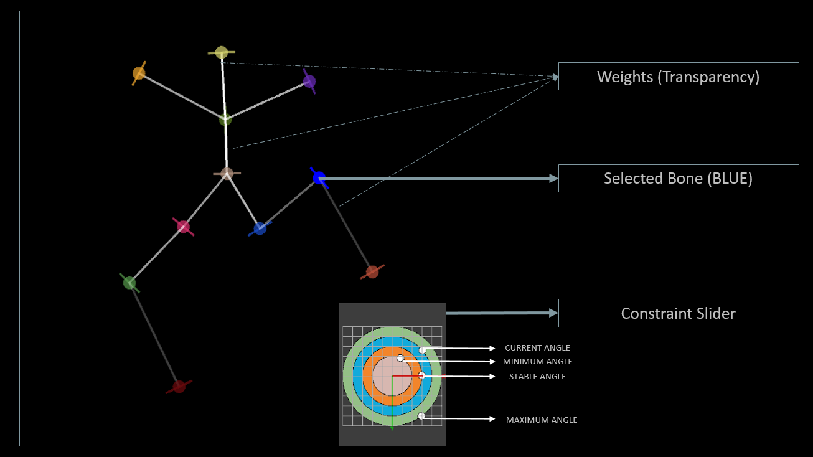
</figure>

It is required to relate actions for setting some parameters with BIAS events.


V:

## Demo: Inverse Kinematics 
Kinematics [2D](https://github.com/sechaparroc/Kinematics-Laplacian) and [3D](https://github.com/sechaparroc/Kinematics-Laplacian-3D).

<video controls data-autoplay loop src="vid/DLS_3D.mp4"></video>

V:

## Demo: Inverse Kinematics 
### Related Papers
<li class="fragment"> Buss S. [Introduction to Inverse Kinematics](http://www.math.ucsd.edu/~sbuss/ResearchWeb/ikmethods/iksurvey.pdf)
<li class="fragment"> Buss S, Kim J. [Selectively Damped Least Squares for Inverse Kinematics](http://www.math.ucsd.edu/~sbuss/ResearchWeb/ikmethods/SdlsPaper.pdf)
<li class="fragment"> Meredith M, Maddock S. [Weighted Real-Time Inverse Kinematics](https://staffwww.dcs.shef.ac.uk/people/S.Maddock/publications/MeredithMaddock2004_GDTW.pdf)


V:

## Demo: Artificial Life Aquarium

<video controls data-autoplay loop src="vid/Aquarium.mp4"></video>

H:

## Future work
### Roadmap

<li class="fragment"> Short term: Release _Proscene3_ -> JS and Android port
<li class="fragment"> February 2017: Release of the course materials

V:

## Future work
### Collaborations

<li class="fragment"> Use the library
<li class="fragment"> Adapt/extend the funcitonality 
<li class="fragment"> Report experiences at the [Processing forum](https://forum.processing.org/two/) using the *proscene* tag

V:

Than you!

N:

* Thank you!
* Q & A
