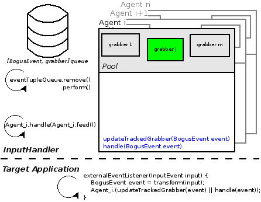

<section id="themes">
	<h2>Themes</h2>
		<p>
			Set your presentation theme: <br>
			<!-- Hacks to swap themes after the page has loaded. Not flexible and only intended for the reveal.js demo deck. -->
			<a href="#" onclick="document.getElementById('theme').setAttribute('href','css/theme/black.css'); return false;">Black (default)</a> -
			<a href="#" onclick="document.getElementById('theme').setAttribute('href','css/theme/white.css'); return false;">White</a> -
			<a href="#" onclick="document.getElementById('theme').setAttribute('href','css/theme/league.css'); return false;">League</a> -
			<a href="#" onclick="document.getElementById('theme').setAttribute('href','css/theme/sky.css'); return false;">Sky</a> -
			<a href="#" onclick="document.getElementById('theme').setAttribute('href','css/theme/beige.css'); return false;">Beige</a> -
			<a href="#" onclick="document.getElementById('theme').setAttribute('href','css/theme/simple.css'); return false;">Simple</a> <br>
			<a href="#" onclick="document.getElementById('theme').setAttribute('href','css/theme/serif.css'); return false;">Serif</a> -
			<a href="#" onclick="document.getElementById('theme').setAttribute('href','css/theme/night.css'); return false;">Night</a> -
			<a href="#" onclick="document.getElementById('theme').setAttribute('href','css/theme/moon.css'); return false;">Moon</a> -
			<a href="#" onclick="document.getElementById('theme').setAttribute('href','css/theme/solarized.css'); return false;">Solarized</a>
		</p>
</section>

H:

# Proscene3 Design

Jean Pierre Charalambos

H:

# Index

 1. Goal <!-- .element: class="fragment" data-fragment-index="1"-->
 2. Design<!-- .element: class="fragment" data-fragment-index="2"-->
 3. BIAS<!-- .element: class="fragment" data-fragment-index="3"-->
 4. Dandelion<!-- .element: class="fragment" data-fragment-index="4"-->
 5. Proscene3<!-- .element: class="fragment" data-fragment-index="5"-->
 6. Roadmap<!-- .element: class="fragment" data-fragment-index="6"-->
 
H:

## Goal: History

* Proscene 1
* Proscene 2

V:

## Goal

Provide interactivity to _application objects_ from any _input source_

V:

## Goal: Application objects

Three main interaction tasks (see ['A Survey of Interaction Techniques for Interactive 3D Environments', Jankowski et al](https://hal.inria.fr/hal-00789413/)):

<li class="fragment"> Navigation
<li class="fragment"> Picking and manipulation
<li class="fragment"> Application control

V:

## Goal: Application objects
### 2D & 3D Navigation

Basic camera types:

<li class="fragment"> Orbit-like methods
<li class="fragment"> First person
<li class="fragment"> Third person

V:

## Goal: Application objects
### Picking & Manipulation

<li class="fragment"> Picking strategies: from input sources, programmatically
<li class="fragment"> Manipulation: emulate 6 DOF's (Default behavior from multiple _input Sources_)

V:

## Goal: Application objects
### Application control

Custom behaviors from multiple _input Sources_

V:

## Goal: Input sources


H:

## Design: API considerations

<li class="fragment"> Simplicity: Separate _application object_ behaviors from _input sources_
<li class="fragment"> Flexibility: Simple default (common) behaviors vs challenging ones

V:

## Design

<li class="fragment"> _Application objects_ -> *Grabbers*
<li class="fragment"> _Input source_ -> *Agents*
<li class="fragment"> Common _event interface_ -> *BogusEvents*

V:

## Design

<figure>
    
    <figcaption>Packages</figcaption>
</figure>

H:

## Bias

<figure>
    
    <figcaption>Packages</figcaption>
</figure>

V:

## Bias

<figure>
    
    <figcaption>Architecture</figcaption>
</figure>

V:

## BIAS
### Grabbers

```java
public interface Grabber {
	/**
	 * Defines the rules to set the application object as
	 * an input grabber.
	 */
	boolean checkIfGrabsInput(BogusEvent event);

	/**
	 * Defines how the application object should behave
	 * according to a given BogusEvent, which may hold
	 * a user-defined action.
	 */
	void performInteraction(BogusEvent event);
}

```

V:

## BIAS
### Action

```java
public interface Action<E extends Enum<E>> {
	/**
	 * Returns group to global action item mappings.
	 */
	E referenceAction();

	/**
	 * Returns a description of the action.
	 */
	String description();
}
```

V:

## BIAS
### Multiple tempi Actions

Idea is quite simple

Multiple tempi actions (such as press-drag-release with a mouse) may be identified from
a Grabber by analysing its flow of actions respect to an initAction, as follows:

V:

## BIAS
### Multiple tempi Actions

| Cases | initAction | action() | Result                           |
|-------|------------|----------|----------------------------------|
| 1     | null       | non-null | start(action())                  |
| 2     | non-null   | null     | stop(initAction)                 |
| 3     | non-null   | non-null | exec(action())                   |
| 4     | non-null   | non-null | stop(initAction); exec(action()) |
| 5     | null       | null     | ignore                           |

V:

## BIAS
### Multiple tempi Actions

* (2) Requires the ```null``` action to be enqueued from the agent (with its new ```flush()``` method)
* (3) ```initAction==action()```, i.e., continous execution
* (4) ```initAction!=action()```, i.e., action changes abruptly

V:

## BIAS
### InteractiveGrabbers

```java
public interface InteractiveGrabber<E extends Enum<E>> extends Grabber {
	public void setAction(Action<E> action);
	public Action<E> action();
}

```

V:

## BIAS
### Agents

Collect and reduce input into a _BogusEvent_ in order to:

<li class="fragment"> Update the _Grabber_ (```agent.inputGrabber()```)
<li class="fragment"> Perform an interaction on the ```agent.inputGrabber()```

V:

## BIAS
### Agents

_BogusEvents_ are of the following types:

 * KeyboardEvent <!-- .element: class="fragment" data-fragment-index="1"-->
 * ClickEvent <!-- .element: class="fragment" data-fragment-index="2"-->
 * MotionEvent <!-- .element: class="fragment" data-fragment-index="3"-->
   * DOF1Event
   * DOF2Event
   * DOF3Event
   * DOF6Event


V:

## BIAS
### Agents

Update the _Grabber_

```java
protected Grabber updateTrackedGrabber(BogusEvent event)
```

The ```inputGrabber()``` may be set with ```agent.setDefaultGrabber(Grabber grabber)```

V:

## BIAS
### Agents

Perform an interaction on the ```inputGrabber()```

```java
protected <E extends Enum<E>> boolean handle(BogusEvent event)
```

Two cases arise:
<li class="fragment"> ```!(inputGrabber() instanceof InteractiveGrabber)``` -> agent send the _bogusEvent_ (to the _Grabber_)
<li class="fragment"> ```else```  -> agent send the _bogusEvent_ *and* attach an _action_ (to the _InteractiveGrabber_) using a _Branch_

V:

## BIAS
### Agent branches

<li class="fragment"> An agent _branch_ is a collection of _Profiles_ (why NOT a single one?)
<li class="fragment"> A _profile_ is a (_bogusEvent_) _shortcut_ _action_ mapping, i.e., ```public class Profile<K extends Shortcut, A extends Action<?>> implements Copyable```
<li class="fragment"> A _shortcut_ is a _bogusEvent_ mean for invoking an _action_

H:

## Dandelion

<figure>
    
    <figcaption>Packages</figcaption>
</figure>

V:

## Dandelion

<li class="fragment"> Default *agents*
<li class="fragment"> Interactivitiy to *frames* (coordinate system _grabbers_)

V:

## Dandelion
### Packages

<li class="fragment"> *dandelion.agent* -> _MotionAgent_ and _KeyboardAgent_
<li class="fragment"> *dandelion.geom* -> _Vec_, _Quat_, _Mat_ and _Frame_ (_Quat_ + _Vec_)
<li class="fragment"> *dandelion.core* -> _Eye_, _GrabberFrame_, _InteractiveFrame_ and _InteractiveAvatarFrame_
<li class="fragment"> *dandelion.constraint* -> Apply constraints to _Frames_ to limit their motion

V:

## Dandelion

<figure>
    
    <figcaption>Frame hierarchy</figcaption>
</figure>

H:

## Proscene3

<figure>
    
    <figcaption>Packages</figcaption>
</figure>

V:

## Proscene3

* Bridge between Dandelion and [Processing3](http://processing.org)
* _Models_ -> _Grabber_ [PShape](https://processing.org/reference/PShape.html) wrapper implementing ```checkIfGrabsInput(event)``` using a [picking buffer](http://content.gpwiki.org/index.php/OpenGL_Selection_Using_Unique_Color_IDs)

<figure>
    
    <figcaption>Picking buffer</figcaption>
</figure>

V:

## Proscene3

<figure>
    
    <figcaption>InteractiveModelObject hierarchy</figcaption>
</figure>

V:

## Proscene3

<figure>
    
    <figcaption>InteractiveModelFrame hierarchy</figcaption>
</figure>

V:

## Proscene3
### Envisaged interactive scenarios: Custom Grabbers

Declare some _grabbers_ and override:

1. public boolean checkIfGrabsInput(event)
2. public void performInteraction(event)

Check the [MouseGrabbers](https://github.com/remixlab/proscene/tree/3.0/examples/Basics/MouseGrabbers) example

V:

## Proscene3
### Envisaged interactive scenarios: Custom GrabberFrames

Everything in Dandelion is _GrabberFrame!_. There's no difference between eyeFrame and iFrame what so ever as it was in Proscene2.

For instance implement custom _InteractiveFrames_, i.e., derive from _GrabberFrame_ and parameterise your custom _iFrame_ using a custom _action_ set

Some examples coming soon!

V:

## Proscene3
### Envisaged interactive scenarios: InteractiveModelFrames

[2D image deformation](https://github.com/sechaparroc/Deformation) and [3D mesh deformation](https://github.com/sechaparroc/Deformation3D)

<figure>
    
</figure>

Currently being ported to Android

V:

## Proscene3
### Envisaged interactive scenarios: InteractiveModelObject

Interactive dance performance using _InteractiveModelObject_

Stages:

1. Gesture recognition
2. Custom action set on the _InteractiveModelObject_ defining its motion (most likely) using Inverse Kinematics
3. Shading

Note: Custom bogus events?

V:

## Proscene3
### Envisaged interactive scenarios: other customizations

* [GrabberObjects](https://github.com/remixlab/proscene-experiments/blob/master/Interaction/ActionGrabbers/Tutorial2/Tutorial2.pde)
* [InteractiveGrabberObjects](https://github.com/remixlab/proscene-experiments/tree/master/Interaction/ActionGrabbers/Tutorial3)
* [GrabberModelFrames](https://github.com/remixlab/proscene-experiments/blob/master/Interaction/CustomModels/Tutorial0/Tutorial0.pde)
* [interacitveModelObjects](https://github.com/remixlab/proscene-experiments/blob/master/Interaction/CustomModels/Tutorial3/Tutorial3.pde)

H:

## Roadmap

<li class="fragment"> Short term: _Alpha3_ -> Support Processing3-a7, Android port
<li class="fragment"> Middle term: _Beta_ cycle -> API docs, comprehensive set of examples, journal paper
<li class="fragment"> May 2015: Release