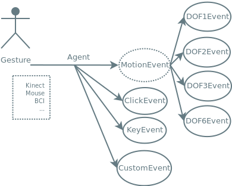

<section id="themes">
	<h2>Themes</h2>
		<p>
			Set your presentation theme: <br>
			<!-- Hacks to swap themes after the page has loaded. Not flexible and only intended for the reveal.js demo deck. -->
			<a href="#" onclick="document.getElementById('theme').setAttribute('href','css/theme/black.css'); return false;">Black (default)</a> -
			<a href="#" onclick="document.getElementById('theme').setAttribute('href','css/theme/white.css'); return false;">White</a> -
			<a href="#" onclick="document.getElementById('theme').setAttribute('href','css/theme/league.css'); return false;">League</a> -
			<a href="#" onclick="document.getElementById('theme').setAttribute('href','css/theme/sky.css'); return false;">Sky</a> -
			<a href="#" onclick="document.getElementById('theme').setAttribute('href','css/theme/beige.css'); return false;">Beige</a> -
			<a href="#" onclick="document.getElementById('theme').setAttribute('href','css/theme/simple.css'); return false;">Simple</a> <br>
			<a href="#" onclick="document.getElementById('theme').setAttribute('href','css/theme/serif.css'); return false;">Serif</a> -
			<a href="#" onclick="document.getElementById('theme').setAttribute('href','css/theme/night.css'); return false;">Night</a> -
			<a href="#" onclick="document.getElementById('theme').setAttribute('href','css/theme/moon.css'); return false;">Moon</a> -
			<a href="#" onclick="document.getElementById('theme').setAttribute('href','css/theme/solarized.css'); return false;">Solarized</a>
		</p>
</section>

H:

# Proscene3 Design

Jean Pierre Charalambos

H:

# Index

 1. Goal <!-- .element: class="fragment" data-fragment-index="1"-->
 2. Design<!-- .element: class="fragment" data-fragment-index="2"-->
 3. BIAS<!-- .element: class="fragment" data-fragment-index="3"-->
 4. Dandelion<!-- .element: class="fragment" data-fragment-index="4"-->
 5. Proscene3<!-- .element: class="fragment" data-fragment-index="5"-->
 6. Demo<!-- .element: class="fragment" data-fragment-index="6"-->
 7. Roadmap<!-- .element: class="fragment" data-fragment-index="7"-->
 
H:

## Goal

> Provide interactivity to _application objects_ from any _gesture input source_

in the simplest possible way:
<!-- .element: class="fragment" data-fragment-index="1"-->

<li class="fragment"> api simplicity & flexibility
<li class="fragment"> customizability

N:
* API simplicity may be evaluated from the set of
instructions needed to accomplish a standard task
over a given domain
* API flexibility is related to as whether or not
an advanced task can be accomplished by the
framework and if so, how.
* Software maintenance and extensibility, such as
when adding new hardware and/or application
user-defined callback routines

V:

## Goal: Interactivity

Universal interaction tasks:

 1. 2D & 3D viewpoint manipulation <!-- .element: class="fragment" data-fragment-index="1"-->
 2. Picking & Manipulation -> select & interaction <!-- .element: class="fragment" data-fragment-index="2"-->
 3. Application Control -> 'post-'WIMP interaction metaphors <!-- .element: class="fragment" data-fragment-index="3"-->


For a relatively recent survey please refer to: "A Survey of Interaction Techniques for Interactive 3D Environments", Jankowski et al., 2013 - STAR.
<!-- .element: class="fragment" data-fragment-index="4"-->

V:

## Goal: Interactivity
### Viewpoint manipulation: 3rd person

<video controls data-autoplay src="vid/flock.ogv"></video>

V:

## Goal: Interactivity
### Viewpoint manipulation: HID's

<video controls data-autoplay src="vid/kinect.webm"></video>

V:

## Goal: Interactivity
### Picking & Manipulation -> select & interaction

<video controls data-autoplay src="vid/creators.mp4"></video>

V:

## Goal: Interactivity
### Application Control -> 'post-'WIMP interaction metaphors

<video controls data-autoplay src="vid/app_ctrl.ogv"></video>

V:

## Goal

It is also about:

<li class="fragment"> Creating academic materials: software + documentation (API-docs + html5 e-book, tutorials & wikis)
<li class="fragment"> Appropriation through collaboration: open-sourcing the materials to encourage hacking them

H:

## Design

<figure>
    
    <figcaption>Packages</figcaption>
</figure>

H:

## Bias

<figure>
    
    <figcaption>Packages</figcaption>
</figure>

V:

## Bias: Package

> Bogus Input Action Selector 

V:

## Bias: goal

<figure>
    
    <figcaption>Communication channel</figcaption>
</figure>

V:

## Bias: User gestures

<figure>
    
    <figcaption>Input sources</figcaption>
</figure>

V:

## Bias: Grabbers

<figure>
    
    <figcaption>Pickable </figcaption>
</figure>

V:

## BIAS: Grabbers

```java
public interface Grabber {
	/**
	 * Defines the rules to set the application object as
	 * an input grabber.
	 */
	boolean checkIfGrabsInput(BogusEvent event);

	/**
	 * Defines how the application object should behave
	 * according to a given BogusEvent, which may hold
	 * a user-defined callback routine.
	 */
	void performInteraction(BogusEvent event);
}
```

V:

## Bias: BogusEvents

<figure>
    
    <figcaption>Input sources</figcaption>
</figure>

Bogus event in that it is a high-level (soft) event which should be reduced from a low-level event
<!-- .element: class="fragment" data-fragment-index="1"-->

V:

## BIAS: BogusEvents
### Shortcuts

> A gesture identifier

Example: The mouse button + modifier mask when a dragging gesture is taking place
<!-- .element: class="fragment" data-fragment-index="1"-->

V:

## BIAS: BogusEvent
### MultiTempi

<li class="fragment"> ```fired()```: event instantiation
<li class="fragment"> ```flushed()```: event termination
<li class="fragment"> ```!fired() && !flushed()```: event execution (default state)

V:

## BIAS: BogusEvent
### Types

_BogusEvent_ instances are of the following types:

 * KeyboardEvent -> 't', 'U', or with modifiers: Shift + 'w'
 <!-- .element: class="fragment" data-fragment-index="1"-->
 * ClickEvent: -> aka "tap", 1,2,...n clicks. Supports modifiers
 <!-- .element: class="fragment" data-fragment-index="2"-->
 * MotionEvent -> kinematics & DOFs, abs/rel, speed
 <!-- .element: class="fragment" data-fragment-index="3"-->
   * DOF1Event
   * DOF2Event
   * DOF3Event
   * DOF6Event

V:

## Bias: Agent
### BogusEvent reduction

<figure>
    
    <figcaption>Collect and reduce input into a _BogusEvent_</figcaption>
</figure>

V:

## Bias: Agent

<figure>
    
    <figcaption>Listening mechanisms</figcaption>
</figure>

V:

## Bias: Agent

<figure>
    
    <figcaption>updateTrackedGrabber()</figcaption>
</figure>

V:

## Bias: Agent

<figure>
    
    <figcaption>handle()</figcaption>
</figure>

V:

## BIAS: Example
### Part 1: Implementing an agent

```java
protected KeyboardEvent currentEvent;

public void keyEvent(processing.event.KeyEvent e) {
    // event reduction Processing -> BogusEvent
    currentEvent = new KeyboardEvent(e.getModifiers(), e.getKey());
    if (e.getAction() == processing.event.KeyEvent.PRESS)
      // update only on press
      updateTrackedGrabber(currentEvent);

    // always handle
    handle(currentEvent);
  }
```

V:

## BIAS: example
### Part 2: Implementing a grabber

```java
public class GrabberObject implements Grabber {
    @Override
    boolean checkIfGrabsInput(BogusEvent event) {
        return withinShapeProjectionArea(event);
    }
    
    @Override
    void performInteraction(BogusEvent event) {
        if ( ( event.shortcut().id() == LEFT ) )
          callback_method(event);
    }
}
```

Check out the [simple callback example](https://github.com/nakednous/bias/blob/master/examples/SimpleCallback/SimpleCallback.pde)

V:

## BIAS: Grabber Profile

A [functional programming](https://en.wikipedia.org/wiki/Functional_programming) extension which parses the event in
```grabber.performInteraction(BogusEvent event)```
to define _Shortcut_ to _Method_ bindings. To set it up just override
the _grabber_ ```performInteraction``` method like this:

```java
@Override
public void performInteraction(BogusEvent event) {
    profile.handle(event);
}
```
<!-- .element: class="fragment" data-fragment-index="1"-->

V:

## BIAS
### Grabbers: Profile

Profiles allow the following simple dialect:

```java
grabber.setMotionBinding(LEFT, "callback_method");
```
<!-- .element: class="fragment" data-fragment-index="1"-->

```java
grabber.setKeyBinding('x', "callback_method");
```
<!-- .element: class="fragment" data-fragment-index="2"-->

```java
grabber.setKeyBinding(SHIFT, 'y', "callback_method");
```
<!-- .element: class="fragment" data-fragment-index="3"-->

```java
grabber.setClickBinding(RIGHT, '2', "callback_method");
```
<!-- .element: class="fragment" data-fragment-index="4"-->

V:

## BIAS: Conclusions

<li class="fragment"> Target audience: Gesture parsing programming, e.g., I/O & Machine learning developers
<li class="fragment"> Multi-language (java + android + js) = Java-based implementation + single-threaded + No-dependencies
<li class="fragment"> Which means it can easily be plugged into any third-party visual computing application
<li class="fragment"> A wide scope of interactive applications
<li class="fragment"> Simple to very complex input setups
<li class="fragment"> Software maintenance and extensibility
<li class="fragment"> Check out the [bias wiki](https://github.com/nakednous/bias/wiki)

N:
* even allowing concurrency of input events on application objects
* such as when adding new hardware and/or application user-defined callback routines

H:

## Dandelion

<figure>
    
    <figcaption>Packages</figcaption>
</figure>

V:

## Dandelion: Goal

> Interactivity to *frames* (coordinate systems)

V:

## Dandelion
### Packages

<li class="fragment"> *dandelion.geom* -> _Vec_, _Quat_, _Mat_ and _Frame_ (_Quat_ + _Vec_)
<li class="fragment"> *dandelion.constraint* -> Apply constraints to _Frames_ to limit their motion
<li class="fragment"> *dandelion.core* -> _GenericFrame_, _KeyFrameInterpolator_, _Eye_, and _AbstractScene_

V:

## Dandelion
### Frame: Hierarchy

```sh
 world
  ^
  |\
  | \  
  f1 eye
  ^   ^
  |\   \
  | \   \
  f2 f3  f5
  ^
  |
  |
  f4
```

```java
  frame.setReferenceFrame(parent);
```

V:

## Dandelion
### Frame: Hierarchy

```java
  Frame frame = new Frame();
  scene.pushModelView();
  scene.applyModelView(frame.matrix());
  // Draw your object here, in the local fr coordinate system.
  scene.popModelView();
```

V:

## Dandelion
### GenericFrame

> A Frame Grabber (frame that implements the Grabber interface)

<li class="fragment"> Frames that are pickable and interactive
<li class="fragment"> A frame is *generic* in that it can belong either to an object or to the Eye
<li class="fragment"> Scene-graph: Allows top/down traversals of the frame hierarchy
<li class="fragment"> third-person cam: A gFrame can be followed by another camera

N:

For the scenegraph we need to keep references to frame children. We did it internally, preserving the same API (setReferenceFrame does it all)

V:

## Dandelion
### KeyFrameInterpolator

[Catmull Rom splines](https://en.wikipedia.org/wiki/Cubic_Hermite_spline#Catmull.E2.80.93Rom_spline) key frames

<video controls data-autoplay src="vid/just_cause.webm"></video>
<!-- .element: class="fragment" data-fragment-index="1"-->

V:

## Dandelion
### Eye

<li class="fragment"> 2D (Window) & 3D (Camera)
<li class="fragment"> Back-face culling
<li class="fragment"> View-frustum made easy, while targetting the [z-Buffer precision](https://www.opengl.org/wiki/Depth_Buffer_Precision)

V:

## Dandelion
### AbstractScene: high-level scene-graph API

High-level secne handler which manages:

<li class="fragment"> Visual hints
<li class="fragment"> Traversal algorithm: ```for (GenericFrame frame : leadingFrames()) visitFrame(frame)```
<li class="fragment"> Frame-hierarchy
<li class="fragment"> BIAS agents

V:

## Dandelion: Conclusions

<li class="fragment"> Target audience: programmers which want to build upon a scenegraph foundation
<li class="fragment"> Multi-language (java + android + js) = Java-based implementation + single-threaded + No-dependencies simple
and coherent scene-graph API
<li class="fragment"> Those of BIAS
<li class="fragment"> It can easily be plugged into any third-party visual computing application

H:

## Proscene3

<figure>
    
    <figcaption>Packages</figcaption>
</figure>

V:

## Proscene3

<li class="fragment"> Bridge between Dandelion and [Processing3](http://processing.org)
<li class="fragment"> Seamless thorough integration between the two
<li class="fragment"> Takes full advantage of Processing concise API and its advanced-rendering capabilities

V:

## Proscene3
### InteractiveFrame

* _InteractiveFrame_ -> _GenericFrame_ [PShape](https://processing.org/reference/PShape.html) wrapper implementing ```checkIfGrabsInput(event)``` using a [picking buffer](http://content.gpwiki.org/index.php/OpenGL_Selection_Using_Unique_Color_IDs)
<figure>
    
    <figcaption>Picking buffer</figcaption>
</figure>

V:

## Proscene3
### Scene: high-level scene-graph API

<li class="fragment"> Default rendering of shapes not already present in the Processing API, such hollow cylinder or cone
<li class="fragment"> Traversal algorithm: ```scene.drawFrames()```
<li class="fragment"> InterativeFrames can be projected onto an arbritary number of (off-screen) graphics buffer (TODO shader examples)

V:

## Proscene3
### Envisaged interactive scenarios: Custom Appearance

```java
  public void setup() {
    frame = new InteractiveFrame(scene, createShape(SPHERE, 40));
  }
```

V:

## Proscene3
### Envisaged interactive scenarios: Custom Appearance

```java
  public void setup() {
    frame = new InteractiveFrame(scene, this, "boxDrawing");
  }
  
  public void boxDrawing(PGraphics pg) {
    pg.box(30);
  }
```

V:

## Proscene3
### Envisaged interactive scenarios: Custom Callback Routines

```java
  public void setup() {
    frame.setMotionBinding(LEFT, "translate");
  }
```

V:

## Proscene3
### Envisaged interactive scenarios: Custom Callback Routines

```java
  public void setup() {
    frame.setMotionBinding(this, LEFT, "boxCustomMotion");
  }
  
  public void boxCustomMotion(InteractiveFrame frame, MotionEvent event) {
    frame.screenRotate(event);
  }
```

V:

## Proscene3
### Envisaged interactive scenarios: MultiTouch Agent
#### DOF6 Gestures:

```java
  DRAG_ONE_ID
  DRAG_TWO_ID
  DRAG_THREE_ID
  TURN_TWO_ID
  TURN_THREE_ID
  PINCH_TWO_ID
  PINCH_THREE_ID
  OPPOSABLE_THREE_ID
```
//TODO: define DRAG/TURN/PINCH and OPPOSABLE using figures!

V:

## Proscene3
### Envisaged interactive scenarios: MultiTouch Agent
#### DOF3 & DOF6 Default callback routines

```java
  hinge
  translateRotateXYZ
  translateXYZ
  rotateXYZ
```

N:
Apart from DOF1 and DOF2 default callback routines

V:

## Proscene3
### Envisaged interactive scenarios: MultiTouch Agent
#### Demo

//TODO add a video here highlighting in text the above callback routines!

V:

## Proscene3: Conclusions

<li class="fragment"> Target audience: that of [Processing](https://processing.org/)
<li class="fragment"> Multi-language (java + android + js) = Java-based implementation + single-threaded + No-dependencies
<li class="fragment"> Single and multi-threaded timers
<li class="fragment"> Those of Dandelion & BIAS, but already pluged in into Processing

H:

## Demo
### Interactive Tools and Applications

<li class="fragment"> Deformation of 2D images and 3D meshes
<li class="fragment"> Forward Kinematics Hierarchical Model
<li class="fragment"> Inverse Kinematics
<li class="fragment"> Artificial Life Aquarium

V:

## Demo: Deformation 2d & 3D
<figure>
    
    <figcaption>Flow</figcaption>
</figure>


V:

## Demo: Deformation 2d & 3D
### Interactive Tools
<li class="fragment"> There are required  tools with which the user could interact that allows to relate some action with a specific region of the image/mesh input (BIAS).
<li class="fragment"> We extend the class interactive Frame (Dandelion) to associate to them information about the image/mesh.

V:

## Demo: Deformation 2d & 3D

<figure>
    
    <figcaption>Interactive Tool</figcaption>
</figure>

V:

## Demo: Deformation 2d & 3D

<figure>
    
    <figcaption>Control Points</figcaption>
</figure>


A transformation  (B) is related to a given point (A)

V:

## Demo: Deformation 2d & 3D

<figure>
    
    <figcaption>Bounding Body</figcaption>
</figure>


A deformation performed to a regular polygon is applied to the input object


V:
## Demo: Deformation 2d & 3D
[2D](https://github.com/sechaparroc/Deformation) and [3D](https://github.com/sechaparroc/Deformation3D) Deformation

<video controls data-autoplay src="vid/deformation.mp4"></video>


V:
## Demo: Deformation 2d & 3D
### Related Papers
<li class="fragment"> Schaefer S, McPhaill T, Warren J. [Image Deformation Using Moving Least Squares](http://faculty.cs.tamu.edu/schaefer/research/mls.pdf)
<li class="fragment"> Sorkine O, Cohen D, Lipman Y, Alexa M, Rossl C, Seidel H. [Laplacian Surface Editing](http://www.cs.berkeley.edu/~jrs/meshpapers/SCOLARS.pdf).


V:

## Demo: Forward Kinematics 
<figure>
    
    <figcaption>Flow</figcaption>
</figure>


V:

## Demo: Forward Kinematics 
<figure>
    
    <figcaption>Interactive Tool</figcaption>
</figure>


V:

## Demo: Forward Kinematics 
<figure>
    
    <figcaption>Hierarchical Kinematic Model</figcaption>
</figure>

V:

## Demo: Forward Kinematics 

<figure>
    
</figure>

Is a typical model used in Kinematics. A Bone is related to a Joint that provides DOF 3. (local coordinates and hierarchy) 

V:
## Demo: Forward Kinematics 
Hierarchical Kinematic Model [2D](https://github.com/sechaparroc/Kinematics-Laplacian) and [3D](https://github.com/sechaparroc/Kinematics-Laplacian-3D).
<video controls data-autoplay src="vid/kinematics.mp4"></video>

V:
## Demo: Forward Kinematics 
### Related Papers
<li class="fragment"> Buss S. [Introduction to Inverse Kinematics](http://www.math.ucsd.edu/~sbuss/ResearchWeb/ikmethods/iksurvey.pdf)
<li class="fragment"> Sorkine O, Cohen D, Lipman Y, Alexa M, Rossl C, Seidel H. [Laplacian Surface Editing](http://www.cs.berkeley.edu/~jrs/meshpapers/SCOLARS.pdf)
<li class="fragment"> University Of California, Computer Animation Course. [Skinning](http://graphics.ucsd.edu/courses/cse169_w05/3-Skin.htm)


V:

## Demo: Inverse Kinematics 
<figure>
    
    <figcaption>Flow</figcaption>
</figure>

V:

## Demo: Inverse Kinematics 

<figure>
    
</figure>

It is required to relate actions for setting some parameters with BIAS events.


V:

## Demo: Inverse Kinematics 
Kinematics [2D](https://github.com/sechaparroc/Kinematics-Laplacian) and [3D](https://github.com/sechaparroc/Kinematics-Laplacian-3D).

<video controls data-autoplay src="vid/DLS_3D.mp4"></video>

V:

## Demo: Inverse Kinematics 
### Related Papers
<li class="fragment"> Buss S. [Introduction to Inverse Kinematics](http://www.math.ucsd.edu/~sbuss/ResearchWeb/ikmethods/iksurvey.pdf)
<li class="fragment"> Buss S, Kim J. [Selectively Damped Least Squares for Inverse Kinematics](http://www.math.ucsd.edu/~sbuss/ResearchWeb/ikmethods/SdlsPaper.pdf)
<li class="fragment"> Meredith M, Maddock S. [Weighted Real-Time Inverse Kinematics](https://staffwww.dcs.shef.ac.uk/people/S.Maddock/publications/MeredithMaddock2004_GDTW.pdf)


V:

## Demo: Artificial Life Aquarium

<video controls data-autoplay src="vid/Aquarium.mp4"></video>


H:

## Roadmap

<li class="fragment"> Short term: Release _Proscene3_ -> JS and Android port
<li class="fragment"> Middle term: _Proscene3_ cycle -> Collaborations (as with most cycles)
<li class="fragment"> February 2017: Release of the curse materials: software + documentation

//TODO possible Collaborations pending to be described


