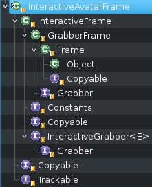

<section id="themes">
	<h2>Themes</h2>
		<p>
			Set your presentation theme: <br>
			<!-- Hacks to swap themes after the page has loaded. Not flexible and only intended for the reveal.js demo deck. -->
			<a href="#" onclick="document.getElementById('theme').setAttribute('href','css/theme/black.css'); return false;">Black (default)</a> -
			<a href="#" onclick="document.getElementById('theme').setAttribute('href','css/theme/white.css'); return false;">White</a> -
			<a href="#" onclick="document.getElementById('theme').setAttribute('href','css/theme/league.css'); return false;">League</a> -
			<a href="#" onclick="document.getElementById('theme').setAttribute('href','css/theme/sky.css'); return false;">Sky</a> -
			<a href="#" onclick="document.getElementById('theme').setAttribute('href','css/theme/beige.css'); return false;">Beige</a> -
			<a href="#" onclick="document.getElementById('theme').setAttribute('href','css/theme/simple.css'); return false;">Simple</a> <br>
			<a href="#" onclick="document.getElementById('theme').setAttribute('href','css/theme/serif.css'); return false;">Serif</a> -
			<a href="#" onclick="document.getElementById('theme').setAttribute('href','css/theme/night.css'); return false;">Night</a> -
			<a href="#" onclick="document.getElementById('theme').setAttribute('href','css/theme/moon.css'); return false;">Moon</a> -
			<a href="#" onclick="document.getElementById('theme').setAttribute('href','css/theme/solarized.css'); return false;">Solarized</a>
		</p>
</section>

H:

# Proscene3 Design

Jean Pierre Charalambos

H:

# Index

 1. Goal <!-- .element: class="fragment" data-fragment-index="1"-->
 2. Design<!-- .element: class="fragment" data-fragment-index="2"-->
 3. BIAS<!-- .element: class="fragment" data-fragment-index="3"-->
 4. Dandelion<!-- .element: class="fragment" data-fragment-index="4"-->
 5. Proscene3<!-- .element: class="fragment" data-fragment-index="5"-->
 
H:

## Goal: History

<li class="fragment"> Proscene 1 (processing 1 cycle)
<li class="fragment"> Proscene 2 (processing 2 cycle)
<li class="fragment"> Proscene 3...

V:

## Goal

Provide interactivity to application objects from any input source

in the 'simplest' possible way <!-- .element: class="fragment" data-fragment-index="1"-->

V:

## Goal: Main interaction tasks

Three main interaction tasks (see ['A Survey of Interaction Techniques for Interactive 3D Environments', Jankowski et al](https://hal.inria.fr/hal-00789413/)):

<li class="fragment"> Navigation
<li class="fragment"> Picking and manipulation
<li class="fragment"> Application control

V:

## Goal: Main interaction tasks
### 1. 2D & 3D Navigation

Basic camera types:

<li class="fragment"> Orbit-like methods
<li class="fragment"> First person
<li class="fragment"> Third person

V:

## Goal: Main interaction tasks
### 2. Picking & Manipulation

<li class="fragment"> Picking strategies: from input sources, programmatically
<li class="fragment"> Manipulation: emulate 6 DOF's (Default behavior from multiple _input Sources_)

V:

## Goal: Main interaction tasks
### 3. Application control (custom behaviors)

Post-WIMP interaction styles
<li class="fragment"> Interfaces “containing at least one interaction technique
not dependent on classical 2D widgets” [[van Dam]](http://dl.acm.org/citation.cfm?id=253708), such as:
<li class="fragment"> Virtual, mixed and augmented reality
<li class="fragment"> [Tangible interaction](https://en.wikipedia.org/wiki/Tangible_user_interface), ubiquitous and pervasive computing, context-aware computing
<li class="fragment"> Handheld, or mobile interaction
<li class="fragment"> Perceptual and [affective computing](https://en.wikipedia.org/wiki/Affective_computing)
  
N:

WIMP: "window, icon, menu, pointing device"
classical 2D widgets:  menus and icons

V:

## Goal

Provide _interactivity_ to _application objects_ from any _input source_

V:

## Goal
### Interactivitiy

* Default: navigation and picking & manipulation
* Custom

V:

## Goal
### Application Objects

* Visual application objects
* Non-visual application objects

V:

## Goal
### Input sources

* Classical
* Non-classical

H:

## Design: API considerations

<li class="fragment"> Simplicity: Separate _application object_ behaviors from _input sources_
<li class="fragment"> Flexibility: Simple default (common) behaviors vs challenging ones

V:

## Design

<li class="fragment"> _Application objects_ -> *Grabbers*
<li class="fragment"> _Input source_ -> *Agents*
<li class="fragment"> Common _event interface_ -> *BogusEvents*

V:

## Design

<figure>
    
    <figcaption>Packages</figcaption>
</figure>

H:

## Bias

<figure>
    
    <figcaption>Packages</figcaption>
</figure>

V:

## Bias

<figure>
    
    <figcaption>Architecture</figcaption>
</figure>

V:

## BIAS
### Bogus events

Message _interface_ between input sources and application objects

V:

## BIAS
### Bogus events: Types

 * KeyboardEvent <!-- .element: class="fragment" data-fragment-index="1"-->
 * ClickEvent <!-- .element: class="fragment" data-fragment-index="2"-->
 * MotionEvent <!-- .element: class="fragment" data-fragment-index="3"-->
   * DOF1Event
   * DOF2Event
   * DOF3Event
   * DOF6Event

V:

## BIAS
### Bogus events: properties

<li class="fragment"> Every _bogus event_ encapsulates a ```Shortcut```
<li class="fragment"> A ```flushed()``` event encapsulates a gesture termination message
<li class="fragment"> Motion events are ```relative``` or ```absolute``` and they have ```speed``` and ```delay```
<li class="fragment"> Bogus events are _extensible_

V:

## BIAS
### Grabbers

```java
public interface Grabber {
	/**
	 * Defines the rules to set the application object as
	 * an input grabber.
	 */
	boolean checkIfGrabsInput(BogusEvent event);

	/**
	 * Defines how the application object should behave
	 * according to a given BogusEvent, which may hold
	 * a user-defined action.
	 */
	void performInteraction(BogusEvent event);
}

```

V:

## BIAS
### Agents

Collect and reduce input into a _BogusEvent_ in order to:

<li class="fragment"> Update the _Grabber_ (```agent.inputGrabber()```)
<li class="fragment"> Perform an interaction on the ```agent.inputGrabber()```

V:

## BIAS
### Agents

Update the _Grabber_

```java
protected Grabber updateTrackedGrabber(BogusEvent event)
```

The ```inputGrabber()``` may be set with ```agent.setDefaultGrabber(Grabber grabber)```

V:

## BIAS
### Agents

Perform an interaction on the ```inputGrabber()```

```java
protected <E extends Enum<E>> boolean handle(BogusEvent event)
```

Two cases arise:
<li class="fragment"> ```!(inputGrabber() instanceof InteractiveGrabber)``` -> agent send the _bogusEvent_ (to the _Grabber_)
<li class="fragment"> ```else```  -> agent send the _bogusEvent_ *and* attach an _action_ (to the _InteractiveGrabber_) using a _Branch_. See _Agent branches_

V:

## BIAS
### Agent branches

<li class="fragment"> An agent _branch_ is a collection of _Profiles_ (why NOT a single one?)
<li class="fragment"> A _profile_ is a (_bogusEvent_) _shortcut_ _action_ mapping, i.e., ```public class Profile<K extends Shortcut, A extends Action<?>> implements Copyable```
<li class="fragment"> A _shortcut_ is a _bogusEvent_ mean for invoking an _action_

V:

## BIAS
### Agent branches: Action

```java
public interface Action<E extends Enum<E>> {
	/**
	 * Returns group to global action item mappings.
	 */
	E referenceAction();

	/**
	 * Returns a description of the action.
	 */
	String description();
}
```

V:

## BIAS
### Agent branches: InteractiveGrabbers

```java
public interface InteractiveGrabber<E extends Enum<E>> extends Grabber {
	public void setAction(Action<E> action);
	public Action<E> action();
}
```

V:

## BIAS
### Agent branches: Multi-tempi Actions

Idea is quite simple

Multiple tempi actions (such as press-drag-release with a mouse) may be identified from
a Grabber by analysing the flow of events respect to an initAction, as follows:

V:

## BIAS
### Agent branches: Multi-tempi Actions

<li class="fragment"> ```initAction(BogusEvent)``` (1st tempi): sets the ```initAction```, called when ```initAction == null```
<li class="fragment"> ```execAction(BogusEvent)``` (2nd tempi): continues action execution, called when ```initAction == action()```
<li class="fragment"> ```flushAction(BogusEvent)``` (3rd tempi): ends action, called when ```BogusEvent.flushed()``` is true or when ```initAction != action()```

H:

## Dandelion

<figure>
    
    <figcaption>Packages</figcaption>
</figure>

V:

## Dandelion

<li class="fragment"> Default *agents*
<li class="fragment"> Interactivitiy to *frames* ( _grabber_ coordinate systems)

V:

## Dandelion
### Packages

<li class="fragment"> *dandelion.branch* -> _InteractiveFrame_ and _InteractiveAvatarFrame_; _MotionAgent_ and _KeyboardAgent_
<li class="fragment"> *dandelion.geom* -> _Vec_, _Quat_, _Mat_ and _Frame_ (_Quat_ + _Vec_)
<li class="fragment"> *dandelion.core* -> _Eye_, _GrabberFrame_
<li class="fragment"> *dandelion.constraint* -> Apply constraints to _Frames_ to limit their motion

V:

## Dandelion

<figure>
    
    <figcaption>Frame hierarchy</figcaption>
</figure>

H:

## Proscene3

<figure>
    
    <figcaption>Packages</figcaption>
</figure>

V:

## Proscene3

* Bridge between Dandelion and [Processing3](http://processing.org)
* _Models_ -> _Grabber_ [PShape](https://processing.org/reference/PShape.html) wrapper implementing ```checkIfGrabsInput(event)``` using a [picking buffer](http://content.gpwiki.org/index.php/OpenGL_Selection_Using_Unique_Color_IDs)

<figure>
    
    <figcaption>Picking buffer</figcaption>
</figure>

V:

## Proscene3: examples

Navigation: All examples

* Orbit-like methods: all examples using a mouse
* First person: [first person](https://github.com/remixlab/proscene/tree/master/examples/Eye/FirstPersonCamera)
* Third person: [third person](https://github.com/remixlab/proscene/tree/master/examples/Eye/ThirdPersonCamera) and [flock](https://github.com/remixlab/proscene/tree/master/examples/Timing/Flock)

V:

## Proscene3: examples

Picking and manipulation: all examples with _Frames_

V:

## Proscene3: examples

Application control: [deformation](https://github.com/nakednous/Deformation)