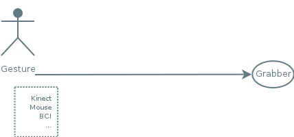
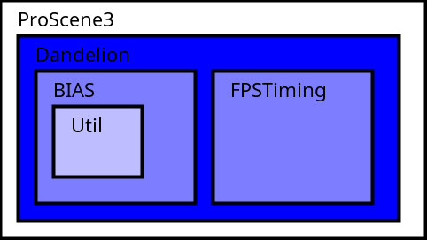

<section id="themes">
	<h2>Themes</h2>
		<p>
			Set your presentation theme: <br>
			<!-- Hacks to swap themes after the page has loaded. Not flexible and only intended for the reveal.js demo deck. -->
			<a href="#" onclick="document.getElementById('theme').setAttribute('href','css/theme/black.css'); return false;">Black (default)</a> -
			<a href="#" onclick="document.getElementById('theme').setAttribute('href','css/theme/white.css'); return false;">White</a> -
			<a href="#" onclick="document.getElementById('theme').setAttribute('href','css/theme/league.css'); return false;">League</a> -
			<a href="#" onclick="document.getElementById('theme').setAttribute('href','css/theme/sky.css'); return false;">Sky</a> -
			<a href="#" onclick="document.getElementById('theme').setAttribute('href','css/theme/beige.css'); return false;">Beige</a> -
			<a href="#" onclick="document.getElementById('theme').setAttribute('href','css/theme/simple.css'); return false;">Simple</a> <br>
			<a href="#" onclick="document.getElementById('theme').setAttribute('href','css/theme/serif.css'); return false;">Serif</a> -
			<a href="#" onclick="document.getElementById('theme').setAttribute('href','css/theme/night.css'); return false;">Night</a> -
			<a href="#" onclick="document.getElementById('theme').setAttribute('href','css/theme/moon.css'); return false;">Moon</a> -
			<a href="#" onclick="document.getElementById('theme').setAttribute('href','css/theme/solarized.css'); return false;">Solarized</a>
		</p>
</section>

H:

# Proscene3 Design

Jean Pierre Charalambos & Sebastian Chaparro

National University of Colombia

H:

# Outline

 1. Goal
 2. Design
 3. Demo
 4. Future work

H:

## Goal

> Provide interactivity to _application objects_ from any _gesture input source_

in the simplest possible way:
<!-- .element: class="fragment" data-fragment-index="1"-->

<li class="fragment"> api simplicity
<li class="fragment"> api flexibility
<li class="fragment"> customizability

N:

... which may be evaluated by:
* No. of instructions needed to accomplish a standard task
over a given domain
* whether or not an advanced task can be accomplished by the
framework
(key: find a good trade-off between those two, because usually they tend to compete)
* software maintenance & extensibility

V:

## Goal: Interactivity

Universal interaction tasks:

 1. Viewpoint Manipulation <!-- .element: class="fragment" data-fragment-index="1"-->
 2. Picking & Manipulation <!-- .element: class="fragment" data-fragment-index="2"-->
 3. (Non-Std) Interaction Metaphor <!-- .element: class="fragment" data-fragment-index="3"-->

<!--
"A Survey of Interaction Techniques for Interactive 3D Environments", Jankowski et al., 2013 - STAR
-->

N:

'Interactivity' within virtual environments can be broken down into the so called three (U.I.T.) for Interactive Environments, which are:

1. Viewpoint manipulation in 3D as well as in 2D
2. Object selection & Interaction
3. Implementation of non-std _interaction metaphors_

Let's see some examples:

V:

## Goal: Interactivity
### Viewpoint manipulation: 3rd person

<video controls data-autoplay loop src="vid/flock.ogv"></video>

N:

This video shows a 3rd person camera control follow-up of the 'Boids' original famous 2D experiment [Craig Reynolds, 1986]. The example is included in the std distro

V:

## Goal: Interactivity
### Viewpoint manipulation: HID's

<video controls data-autoplay loop src="vid/kinect.mp4"></video>

N:

This video displays part of a recent usability comparative study using non-std interaction techniques. Developed as M. Sc. thesis

V:

## Goal: Interactivity
### Picking & Manipulation

<video controls data-autoplay loop src="vid/cut.mp4"></video>

N:

This video shows an excerpt of an audio reactive multitouch tabletop screen app, developed in collaboration with ['the creators'](https://vimeo.com/25224777) Information Visualisation studio, University of Sydney

V:

## Goal: Interactivity
### Non-std interaction metaphors

<video controls data-autoplay loop src="vid/app_ctrl.ogv"></video>

N:

This video shows how the 3D shapes can easily be controled and manipulated with the 2D ones. The example is included in the std distro

V:

## Goal

It is also about:

<li class="fragment"> Creating academic materials
<li class="fragment"> Appropriation through collaboration

N:

* Creating academic materials comprising software + documentation (API-docs + html5 e-book, tutorials & wikis)
* Open-sourcing the materials to encourage hacking them

H:

## Design
### _Onion_ architecture

<figure>
    
    <figcaption>Packages</figcaption>
</figure>

N:

For the design we just used an 'onion architecture' which controls coupling: all code can depend on core layers (but no the other way around). Those layers are implemented as *git subtrees*

H:

## Bias

<figure>
    
    <figcaption>Packages</figcaption>
</figure>

V:

## Bias: Package

> (B)ogus (I)nput (A)ction (S)elector

N:

Action = user-defined callback routine

V:

## Bias: goal

<figure>
    
    <figcaption>Communication pipeline</figcaption>
</figure>

N:

BIAS goal is to open up a communication pipeline between the user and grabber objects.
Messages sent through this pipeline form the basis to implementing (U.I.T.)
as we'll see in a minute

V:

## Bias: User gestures

<figure>
    
    <figcaption>Input sources</figcaption>
</figure>

N:

User gestures are gathered from any input source such as
... (B)rain (C)omputer (I)nterface or any (H)uman (Interface) (D)evice.
What have you!

V:

## Bias: Grabbers

<figure>
    
    <figcaption>Pickable </figcaption>
</figure>

N:

Grabbers are interactive user-space objects possibly having a visual representation
(an exception being the point-of-view or 'eye')

V:

## BIAS: Grabbers

```java
public interface Grabber {
	boolean checkIfGrabsInput(BogusEvent event);
	void performInteraction(BogusEvent event);
}
```

N:

... they have a very simple specification:
1. Defines the rules to set the application object as an input grabber
2. Defines how the application object should behave

V:

## Bias: BogusEvents

<figure>
    
    <figcaption>Input sources</figcaption>
</figure>

N:

... messages sent through this pipeline are called bogus events. An event is bogus in that it is a high-level (soft) event that should be reduced from a low-level event

Lets see some bogus events mighty features...

V:

## BIAS: BogusEvents
### Shortcuts

> A gesture identifier

N:

... they have shortcuts which are gesture identifiers. Example:
* the mouse button + modifier mask when a dragging gesture is taking place

V:

## BIAS: BogusEvent
### MultiTempi

<li class="fragment"> ```fired()``` & ```flushed()```
<li class="fragment"> ```!fired() && !flushed()```: event execution (default state)

N:

* ... they have two states: initialization & termination
* ... and a the third (execution) which can be infered from those two

Example:
* ```fired()``` : mouse pressed
* ```flushed()``` : mouse released
* ```!fired() && !flushed()``` : mouse dragged

V:

## BIAS: BogusEvent
### Types

_BogusEvent_ instances are of the following types:

 * KeyboardEvent
 <!-- .element: class="fragment" data-fragment-index="1"-->
 * ClickEvent
 <!-- .element: class="fragment" data-fragment-index="2"-->
 * MotionEvent
 <!-- .element: class="fragment" data-fragment-index="3"-->
   * DOF1Event
   * DOF2Event
   * DOF3Event
   * DOF6Event
   
N:

bogus-events are of the following types:
* ... defining a single key stroke; or, a combo key stroke: single key stroke + modifier key
* ... defining a "tap" event
* ... defining the app kinematics & which are characterized by DOFs

V:

## Bias: Agent
### BogusEvent reduction object

<figure>
    
    <figcaption>Collect and reduce input into a _BogusEvent_</figcaption>
</figure>

N:

The object responsible to parse user gestures is called 'Agent'.
Its goal is to collect and reduce input into a _BogusEvent_

V:

## Bias: Agent

<figure>
    
    <figcaption>Listening mechanisms</figcaption>
</figure>

N:

Agents provide 2 listening mechanisms:
1. Polling, which is done throught the InputHandler (high-level package handler)
2. Using the application's own listening mechanism

V:

## Bias: Agent
### Message types sent to grabbers

| Agent                         | Grabber                    |
|-------------------------------|----------------------------|
| ```updateTrackedGrabber()```  | ```checkIfGrabsInput()```  |
| ```handle()```                | ```performInteraction()``` |

N:

* The _agent_ *uTG* call is related to the *cIGI* _grabber_ call
* The _agent_ *h* call is related to the *pI* _grabber_ call

lets see how

V:

## Bias: Agent

<figure>
    
    <figcaption>updateTrackedGrabber()</figcaption>
</figure>

N:

In the *uTG* case the
1. Agent queries each object in the *grabbers* collection to check if the *cIGI* condition is met
2. The first object meeting it will be set as application the inputGrabber() and returned

V:

## Bias: Agent

<figure>
    
    <figcaption>handle()</figcaption>
</figure>

N:

In the *h* case the
1. The agent enqueues an ```EventGrabberTuple()``` on the
InputHandler ```eventTupleQueue()```.
2. At the end of main event loop the *pI*
method is then called on the ```inputGrabber()```

V:

## BIAS: Conclusions

<li class="fragment"> Target audience: I/O developers
<li class="fragment"> Lightweight Java-based implementation
<li class="fragment"> Multi-language support
<li class="fragment"> A wide scope of interactive applications
<li class="fragment"> Software maintenance and extensibility

N:

* ... machine learning developers
* ... (single-threaded + No-dependencies) can easily be plugged into any third-party visual computing application
* ... java + android + js (but also 3rd party python and ruby ports are known to us)
* ... ranging simple to very complex setups, even allowing concurrency of input events on application objects
* ... such as when adding new hardware and/or user-defined actions

H:

## Dandelion

<figure>
    
    <figcaption>Packages</figcaption>
</figure>

V:

## Dandelion: Goal

> Interactivity to *frames* (coordinate systems)

V:

## Dandelion
### Packages

<li class="fragment"> *dandelion.geom*
<li class="fragment"> *dandelion.constraint*
<li class="fragment"> *dandelion.core* 

N:

* ... _Vec_, _Quat_, _Mat_ and _Frame_ (_Quat_ + _Vec_)
* ... Apply constraints to _Frames_ to limit their motion
* ... detailed shortly

V:

## Dandelion
### Frame: Hierarchy

```sh
 world
  ^
  |\
  | \  
  f1 eye
  ^   ^
  |\   \
  | \   \
  f2 f3  f5
  ^
  |
  |
  f4
```

```java
  frame.setReferenceFrame(parent);
```

N:

The collection of ```frames()``` forms a scene-graph of transformations
which only requires that each frame keeps a reference to its parent

V:

## Dandelion
### GenericFrame

> A Grabber Frame

Features:

<li class="fragment"> Generic
<li class="fragment"> Scene-graph foundation
<li class="fragment"> Third-person camera

N:

A Grabber Frame: a frame that implements the _Grabber_ interface -> Frames that are pickable and interactive

* A _gF_ is *generic* in that it can belong either to an object or to the Eye
* _gFs_ are organized in a tree-like structure allowing top/down traversals of the hierarchy
* A _gF_ can be followed by another _gF_

V:

## Dandelion
### KeyFrameInterpolator

<video controls data-autoplay loop src="vid/just_cause.mp4"></video>

N:

* [Catmull Rom splines](https://en.wikipedia.org/wiki/Cubic_Hermite_spline#Catmull.E2.80.93Rom_spline) key frames
* Point cloud visualization of 11' player impact events in the videogame, Just Cause 2. Developed in collaboration with [Square Enix](https://www.youtube.com/watch?v=hEoxaGkNcrg&feature=player_embedded#at=19)

V:

## Dandelion
### Eye

A 2D (Window) & 3D (Camera), featuring:

<li class="fragment"> Useful positioning tools
<li class="fragment"> Simple bounding area/volume view
<li class="fragment"> Back-face & view frustum culling
<li class="fragment"> Stereo capabilities

N:

* ... which eases its placement
* ... which is defined by a bounding ball, while targetting the [z-Buffer precision](https://www.opengl.org/wiki/Depth_Buffer_Precision)
* ... supporting advanced interactive apps
* ... just in time for the _android cardboard_

V:

## Dandelion
### AbstractScene: high-level scene-graph API

High-level scene handler which manages:

<li class="fragment"> Visual hints
<li class="fragment"> Traversal algorithm
<li class="fragment"> Frame-hierarchy
<li class="fragment"> BIAS agents

V:

## Dandelion: Conclusions

<li class="fragment"> Target audience: scenegraph programmers
<li class="fragment"> Multi-language
<li class="fragment"> Those of BIAS

N:

* ... programmers which want to build upon a (simple and coherent) scenegraph foundation
* ... java + android + js (but also 3rd party python and ruby ports are known to us)
* ... e.g., it can easily be plugged into any third-party visual computing application

H:

## Proscene3

<figure>
    
    <figcaption>Packages</figcaption>
</figure>

V:

## Proscene3

> Bridge between Dandelion and [Processing3](http://processing.org)

N:

... providing seamless thorough integration between the two, while taking full advantage of Processing main features such as its concise API and advanced-rendering capabilities

V:

## Proscene3
### InteractiveFrame

_InteractiveFrame_: _GenericFrame_ [PShape](https://processing.org/reference/PShape.html) wrapper
<figure>
    
    <figcaption><a href="http://www.lighthouse3d.com/tutorials/opengl-selection-tutorial/">PickingBuffer</a></figcaption>
</figure>

V:

## Proscene3
### Scene: high-level scene-graph API

<li class="fragment"> Default rendering of shapes not already present in the Processing API
<li class="fragment"> Traversal algorithm: ```scene.drawFrames()```
<li class="fragment"> InterativeFrames can be projected onto an arbritary number of (off-screen) graphics buffer

N:

* ... such hollow cylinder or cone
* ... achieved with one simple line of code
* ... e.g., minimaps

V:

## Proscene3
### Envisaged interactive scenarios: Appearance

```java
  public void setup() {
    frame = new InteractiveFrame(scene, createShape(SPHERE, 40));
  }
```

N:

This simple code creates a pickable fully interactive sphere

V:

## Proscene3
### Envisaged interactive scenarios: Custom Appearance

```java
  public void setup() {
    frame = new InteractiveFrame(scene, this, "boxDrawing");
  }
  
  public void boxDrawing(PGraphics pg) {
    pg.box(30);
  }
```

N:

Fully interactive _arbitrary_ graphics procedures, like the one in this code, require no inheritance

V:

## Proscene3
### Envisaged interactive scenarios: Actions

```java
  public void setup() {
    frame.setMotionBinding(LEFT, "translate");
  }
```

N:

Binding a _default_ motion action (```translate```) is as simple as this code

V:

## Proscene3
### Envisaged interactive scenarios: Custom Actions

```java
  public void setup() {
    frame.setMotionBinding(this, LEFT, "boxCustomMotion");
  }
  
  public void boxCustomMotion(InteractiveFrame frame, MotionEvent event) {
    frame.screenRotate(event);
  }
```

N:

Binding a _custom_ motion action (```translate```), like this code, require no inheritance

V:

## Proscene3
### Envisaged interactive scenarios: MultiTouch Agent
#### Demo

<video controls data-autoplay loop src="vid/android.mp4"></video>

N:

Currently being part of M. Sc. by Victor Forero
* Gestures recognization is key
* (Event though it already works) Future work includes using machine learning techniques to improve it
* Support up till DOF6 actions

V:

## Proscene3: Conclusions

<li class="fragment"> Target audience: that of [Processing](https://processing.org/)
<li class="fragment"> Multi-language
<li class="fragment"> Those of Dandelion & BIAS

N:

* ... i.e., visual artists & designers and hobbyists where simplicity is _key_
* ... java + android + js (but also 3rd party python and ruby ports are known to us)
* ... but already pluged in into Processing

H:

## Demo
### Interactive Tools and Applications

<li class="fragment"> Deformation of 2D images and 3D meshes
<li class="fragment"> Forward Kinematics Hierarchical Model
<li class="fragment"> Inverse Kinematics
<li class="fragment"> Artificial Life Aquarium

N:

* Proscene give as advantage when we developed int. apps
* use de modules BIAS + Dandelion for that puspose
* Aquarium: uses concepts of the previous applications

V:

## Demo: Deformation 2d & 3D
<figure>
    
    <figcaption>Flow</figcaption>
</figure>

N:
ALL int. app follows the next flow:
- Input: basic pose
- User interaction: Tell the app how to identify the actions that the user perform with the interactive tools.
- Output: some changes in the shape of the input

V:

## Demo: Deformation 2d & 3D
### Interactive Tools
<li class="fragment"> There are required  tools with which the user could interact and that allows to relate some action with a specific region of the image/mesh input.
<li class="fragment"> We extend the class interactive Frame to associate to them information about the image/mesh.

N:
- Higher level layer: Interactive frame modifies another
- Dandelion Local coordinates & BIAS for handling objects that can be “grabbed”.

V:

## Demo: Deformation 2d & 3D

<figure>
    
    <figcaption>Interactive Tool</figcaption>
</figure>

N:
* For the kind of algorithms we're showing,it seems that the same metaphor needs to be implemented, we call this interactive tools
* Interactive frame related with another one (mesh) that enable us to modify some information.
* Get information: Based on distance
* Execute some kind of action that modifies that information 


V:

## Demo: Deformation 2d & 3D

<figure>
    
    <figcaption>Control Points</figcaption>
</figure>

A transformation (B) is related to a given point (A)

N:

* what is a Control Point?: Basic Interactive tool: relates a given point some transformation
* A transformation  (e.g Rotation, translation)  (B) is related to a given point ( A) in the space (defined by a local coordinate system).
* If the origin (A) is grabbed a motion action is applied to the origin and the image points.
* If the image (B) is grabbed the transformation is applied just to the image point (B) (Local coordinate space)


V:

## Demo: Deformation 2d & 3D

<figure>
    
    <figcaption>Bounding Body</figcaption>
</figure>

A deformation performed to a regular polygon is applied to the input object

N:
* Usage of an auxiliary scene to deform a regular polygon. 
* The given polygon wraps the object (Interactive Frame) to the deform.
* DOF 1 event: Changes the number of vertices.
* Motion events: translates the nearest vertex to the cursor, rotates the bounding body.

V:
## Demo: Deformation 2d & 3D
[2D](https://github.com/sechaparroc/Deformation) and [3D](https://github.com/sechaparroc/Deformation3D) Deformation

<video controls data-autoplay src="vid/deformation.mp4"></video>

N: 
* Locate the control points
* Asciate near vertices to the interactive tool
* kind of predefined control points based on bounding box.
* Dof 1 to define number edges of the polygon


<!--
Vertival:
## Demo: Deformation 2d & 3D
### Related Papers

<li class="fragment"> Schaefer S, McPhaill T, Warren J. [Image Deformation Using Moving Least Squares](http://faculty.cs.tamu.edu/schaefer/research/mls.pdf)
<li class="fragment"> Sorkine O, Cohen D, Lipman Y, Alexa M, Rossl C, Seidel H. [Laplacian Surface Editing](http://www.cs.berkeley.edu/~jrs/meshpapers/SCOLARS.pdf).

Notes:

* Free Form DEformation: don't take into account the structure of the mesh
* defining the new position based on the weight that each control point gives.
* Laplacian coordinates, local space, gives information about the relationship btwn vertices
* Rigid deformations, no shearing.
-->

V:

## Demo: Forward Kinematics 

<figure>
    
    <figcaption>Flow</figcaption>
</figure>

N:

* Basically the same flow that we've seen in the previous instance, but the user uses other kind of interaction tool
* Skeleton that's a common way of representation

V:

## Demo: Forward Kinematics 

<figure>
    
    <figcaption>Interactive Tool</figcaption>
</figure>

N: 
* again a tool has to be related with an interactive frame and basically a method to get some information, and another
one to set the information obtained, based on the actions of the user

V:

## Demo: Forward Kinematics 
<figure>
    
    <figcaption>Hierarchical Kinematic Model</figcaption>
</figure>

N:
* Is a typical model used in Kinematics. A Bone is related to a Joint that provides DOF 3.

V:

## Demo: Forward Kinematics 

<figure>
    
</figure>

Is a typical model used in Kinematics. A Bone is related to a Joint that provides DOF 3. (local coordinates and hierarchy) 

N:

* Usage of local coordinates and hierarchy (interactive Frames) 
* Overrided ClickEvent to add or delete Bones.
* DOF 1 events overrided for other purposes: (Weight, Width, enable/disable  end effector).


V:
## Demo: Forward Kinematics 
Hierarchical Kinematic Model [2D](https://github.com/sechaparroc/Kinematics-Laplacian) and [3D](https://github.com/sechaparroc/Kinematics-Laplacian-3D).
<video controls data-autoplay src="vid/kinematics.mp4"></video>

<!--
Vertical:
## Demo: Forward Kinematics 
### Related Papers
Buss S. [Introduction to Inverse Kinematics](http://www.math.ucsd.edu/~sbuss/ResearchWeb/ikmethods/iksurvey.pdf)
Sorkine O, Cohen D, Lipman Y, Alexa M, Rossl C, Seidel H. [Laplacian Surface Editing](http://www.cs.berkeley.edu/~jrs/meshpapers/SCOLARS.pdf)
University Of California, Computer Animation Course. [Skinning](http://graphics.ucsd.edu/courses/cse169_w05/3-Skin.htm)


Notes:
* Hiearchical model 1st paper
* Its required to define the way in which the skeleton will modify the mesh
* Take adv of rigid transformation and uses the laplacian.
* Skinning based on distance bone, vertex and give a weight to each bone.
-->

V:

## Demo: Inverse Kinematics 
<figure>
    
    <figcaption>Flow</figcaption>
</figure>

N:
* Kinematics is the study of how things move, it
describes the motion of a hierarchical skeleton
structure
* input is given, kinematic chain
* User stablish final position of the end effectors
* Get values of the joints based on future position desired


V:

## Demo: Inverse Kinematics 

<figure>
    
</figure>

It is required to relate actions for setting some parameters with BIAS events.

N: 

* our goal is to compute values of the joints that will cause the
end effector to reach some desired state

V:

## Demo: Inverse Kinematics 
Kinematics [2D](https://github.com/sechaparroc/Kinematics-Laplacian) and [3D](https://github.com/sechaparroc/Kinematics-Laplacian-3D).

<video controls data-autoplay src="vid/DLS_3D.mp4"></video>

<!--
Vertical:

## Demo: Inverse Kinematics 
### Related Papers
<li class="fragment"> Buss S. [Introduction to Inverse Kinematics](http://www.math.ucsd.edu/~sbuss/ResearchWeb/ikmethods/iksurvey.pdf)
<li class="fragment"> Buss S, Kim J. [Selectively Damped Least Squares for Inverse Kinematics](http://www.math.ucsd.edu/~sbuss/ResearchWeb/ikmethods/SdlsPaper.pdf)
<li class="fragment"> Meredith M, Maddock S. [Weighted Real-Time Inverse Kinematics](https://staffwww.dcs.shef.ac.uk/people/S.Maddock/publications/MeredithMaddock2004_GDTW.pdf)

Notes:
* Minimizes the iterative way error btwn the actual position and the desired one, take into account a damped constant for cases in with a singularity is possble.
* Apply a weight to each bone with the idea to avoid the movement of bones which are heavy enought.
-->

V:

## Demo: Artificial Life Aquarium

<video controls data-autoplay src="vid/Aquarium.mp4"></video>

N:
* Aquarium: use of AI concept segregation model for forming groups fish schools, diffusion reaction model for the construction of the textures, to be enhanced, Raynolds model based on separation, alingment and cohesion, L-sistems construction of pretty basic trees to be improved. Lights and so on

H:

## Future work
### Roadmap

<li class="fragment"> Short term: Release _Proscene3_ -> JS and Android port
<li class="fragment"> February 2017: Release of the course materials

V:

## Future work
### Collaborations

<li class="fragment"> Use the library
<li class="fragment"> Adapt/extend the funcitonality 
<li class="fragment"> Report experiences at the [Processing forum](https://forum.processing.org/two/) using the *proscene* tag

V:

Than you!

N:

* Thank you!
* Q & A
